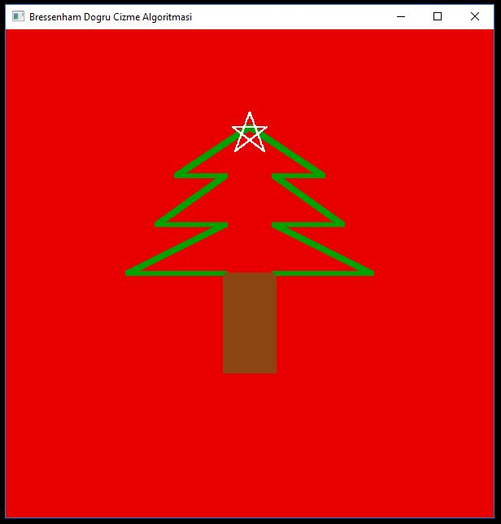

# bresenhamOpenGLDemo
## OpenGL
OpenGL, gelişmiş donanım desteğini kullanarak hem iki hem de üç boyutlu grafikleri ekrana çizmek için kullanılan ücretsiz bir grafik uygulama geliştirme arabirimidir. Windows, Linux, MacOS ve Solaris gibi birçok işletim sisteminde yaygın olarak desteklenir.

## Bresenham Algoritması
Amerikalı bilgisayar mühendisi Jack Bresenham tarafindan, 1960\`lı yıllarda IBM için doğrunun bilgisayar ekranına çizimi için geliştirilen bir doğru çizme algoritmasıdır. İki veya üç boyutlu ortamlarda kullanılabilir. Buna göre başlangıç ve bitiş noktalarının koordinatları belirli bir doğruyu çizmek için nasıl bir yol izleneceğini belirler ve bu doğrunun geçtiği imgeciklerin (pixel) hesaplanmasında kullanılır. Detaylı bilgiyi [link](http://bilgisayarkavramlari.sadievrenseker.com/2008/08/28/bresenham-dogru-cizim-algoritmasi-bresenhams-algorithm/)\'den edinebilirsiniz.

# Projenin Çalıştırılması
Projeyi çalıştırmak için ortam olarak Visual Studio programını edinmemiz gerekiyor. Daha sonra dışardan indirerek eklememiz gereken <strong><i>GLU/GLUT</i></strong> kütüphaneleri var. Onlara [bu linkten](http://www.mediafire.com/file/cmlnr0pj0pyha5d/Glew_and_Glut.zip/file) ulaşabilirsiniz. Dosyayı indirdikten sonra ilk olarak dosya içindeki ".dll" uzantılı belgeleri <i>C:\Windows\System32</i> dosya yolundaki klasörün içine kopyalayıp yapıştırmamız gerekli.

Ardından projeyi Visual Studio ile başlattıktan sonra sağ tarafta bulunan kısımda projenin üzerine sağ tıklayarak <strong>Özellikler</strong> kısmına giriyoruz.

Burada karşımıza çıkan ekranda C/C++ seçeneğinin <strong>Genel</strong> kısmındaki <strong>Ek İçeren Dizinler</strong> seçeneğine girip, indirdiğimiz dosya dizininin içinden ayrı ayrı <strong>include</strong> dosyalarını ekliyoruz.

İkinci olarak <strong>Bağlayıcı</strong> kısmındaki <strong>Ek Kitaplık Dizinleri</strong> seçeneğine girip, indirdiğimiz dosya dizininin içinden ayrı ayrı <strong>lib</strong> dosyalarını ekliyoruz.

Bütün ekleme işlemlerinin ardından projemizi çalıştırabiliriz. Run tuşuna bastıktan sonra karşımıza çıkan arayüzde böyle bir görüntü belirecektir.

